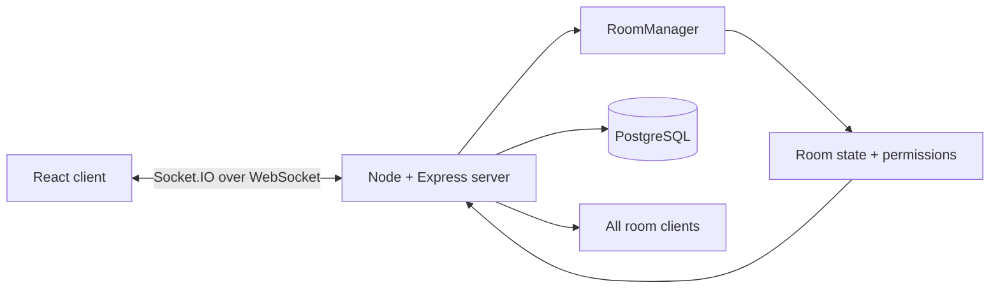

# Watchtower

Watchtower is a real-time YouTube watch party built for the intern assignment. People join a room, share one timeline, chat, and follow a permission model where the host and moderators control playback while participants can request changes.

## Live demo

**Live URL:** `https://YOUR-APP-NAME.onrender.com`

Replace the placeholder above with the deployed Render URL before submitting. The project includes a `render.yaml` so the deployment is a single Node web service with WebSocket support.

## What is implemented

- Create a room with a short invite code and shareable link.
- Join by room code or `/room/:code` link.
- Public landing page with Log in and Sign up actions; guests can create or join as Guest, while PostgreSQL-backed accounts add a profile username, a live password-strength meter, and server-side password hashing.
- Private per-account room history: signed-in users can see rooms they hosted or joined, their room codes, and their last activity time.
- A dedicated About page linked from the landing-page footer.
- YouTube IFrame Player API embedded in a custom, role-aware player surface.
- Server-authoritative play, pause, seek, and change-video synchronization.
- Host, moderator, participant, and viewer roles.
- Backend permission checks before every privileged action.
- Host role assignment, participant removal, and host transfer.
- Participant approval requests for playback changes.
- Real-time room chat.
- Live emoji reactions that appear for everyone watching the room.
- A compact, auto-rotating glass feature carousel on the landing page.
- Reconnect/error/loading states and responsive UI for desktop and mobile.
- OOP-style `Room`, `Participant`, and `RoomManager` classes on the backend.

## Run locally

Requirements: Node.js 20+, npm 10+, and a PostgreSQL database. Render PostgreSQL is the recommended option for this project.

1. Create a `.env` file in the project root from `.env.example`.
2. Paste your Render **External Database URL** into `DATABASE_URL` for local development.
3. Keep `.env` private; it is intentionally ignored by Git and ZIP releases.

```bash
npm install
npm run dev
```

Open `http://localhost:5173`. Vite proxies Socket.IO traffic to the backend at `http://localhost:4000`.

On first start, the server creates the `users`, `sessions`, and `room_history` tables from `server/migrations/001_auth.sql`. No separate SQL command is required. Existing accounts and signed-in users’ room history now survive server restarts.

The normal dev command intentionally keeps the backend process stable because room state is held in memory; an automatic backend restart would disconnect guests and create a fresh set of rooms. Vite still hot-reloads frontend changes. After editing server files, stop and rerun `npm run dev`. If you specifically want backend file watching during development, run `npm run dev:watch --workspace server` separately.

For a production-like local run:

```bash
npm run build
NODE_ENV=production npm start
```

Then open `http://localhost:4000`.

## Recommended demo flow

1. Open two browser tabs.
2. In tab A, create a room and copy the invite link/code.
3. In tab B, join using the code.
4. In tab A, paste a YouTube URL and change the video. Play, pause, and seek; tab B should follow.
5. In tab B, use `Request play`. In tab A, approve it from the request queue.
6. In tab A, promote tab B to Moderator and show that the playback controls unlock.
7. Use the reaction bar from either tab and show the emoji float over both players.
8. Send a chat message and remove the second participant to demonstrate the full room-management flow.

## Architecture overview



The server keeps the authoritative state for each room:

- `Room` stores participants, roles, pending requests, chat history, and the current YouTube playback state.
- `RoomManager` creates rooms, resolves IDs/codes, and removes empty rooms.
- Socket handlers validate the acting participant before applying an event.
- PostgreSQL persists registered users and their server-issued login sessions; passwords remain hashed with `scrypt` and are never returned to the client.
- When an authenticated socket creates or joins a room, the server records a private `room_history` entry for that account. Rejoining the same room updates its last-activity time instead of producing duplicate rows.
- A successful state change is broadcast as `sync_state` to every socket in the Socket.IO room.
- The host reports a lightweight playback heartbeat every few seconds, so `Sync now` can correct a participant against the host's fresh timeline rather than an old play/seek event.
- The client calculates a small late-join offset from `updatedAt`, so a new participant catches up to a video that is already playing.

The most important security boundary is on the backend. UI buttons are disabled for participants for clarity, but the server also rejects unauthorized `play`, `pause`, `seek`, `change_video`, role, removal, and host-transfer events.

## Key event flow

| Client event | Backend validation | Broadcast result |
| --- | --- | --- |
| `join_room` | Room exists and is below capacity | `room_joined`, `user_joined` |
| `play`, `pause`, `seek`, `change_video` | Host or Moderator | `sync_state` |
| `playback_progress` | Host, or the moderator who last controlled playback | Refreshes the authoritative timeline without interrupting other viewers |
| `sync_now` | Joined room member | Sends the latest timeline to that member and forces a local correction |
| `request_action` | Participant is not already a controller | `approval_request` |
| `resolve_request` | Host or Moderator | `request_resolved`, then `sync_state` if approved |
| `assign_role` | Host only | `role_assigned` |
| `remove_participant` | Host only | `participant_removed` |
| `reaction` | Joined room member; valid emoji and a short cooldown | `reaction` to everyone in the room |
| `chat_message` | Joined room member | `chat_message` |
| `create_room`, `join_room` | Signed-in account only | Private PostgreSQL room-history entry |

## Deployment on Render

1. Push this repository to GitHub.
2. In Render, create a new Web Service from the repository.
3. Render can use the checked-in `render.yaml`, or set:
   - Build command: `npm install && npm run build`
   - Start command: `npm start`
   - Health check path: `/health`
4. Set `NODE_VERSION=20`.
5. Set `CLIENT_ORIGIN` to the final Render URL if you want an explicit CORS allow-list. Same-origin production hosting also works without it.
6. Set `DATABASE_URL` to the **Internal Database URL** from your Render PostgreSQL database. Keep the web service and database in the same Render region.
7. Open the deployed URL and run the demo flow above. Add the final URL to this README before submission.

## Code walkthrough talking points

- Socket.IO gives the app a bidirectional event channel while retaining the WebSocket transport in production; it also gives the server named rooms for fan-out.
- The server applies state changes once, then broadcasts the resulting state. Clients do not make independent playback decisions.
- A pending participant request is a normal room object with a lifecycle: `pending` -> `approved` or `rejected`.
- Reactions are deliberately ephemeral: they are validated and broadcast in real time, but do not clutter room history.
- Room state remains intentionally in memory for low-latency Socket.IO syncing, while PostgreSQL persists accounts, sessions, and private room history. A production scale-out would use Redis for room state/pub-sub and retain PostgreSQL for durable data.
- The YouTube player is controlled through the IFrame API. Browser autoplay policies can block a remote play call; `Sync now` provides a user-gesture recovery path.

## Tests

```bash
npm test
npm run build
```

The server tests cover creator/participant permissions, moderator promotion, bounded authoritative playback state, and the PostgreSQL-backed authentication flow.
